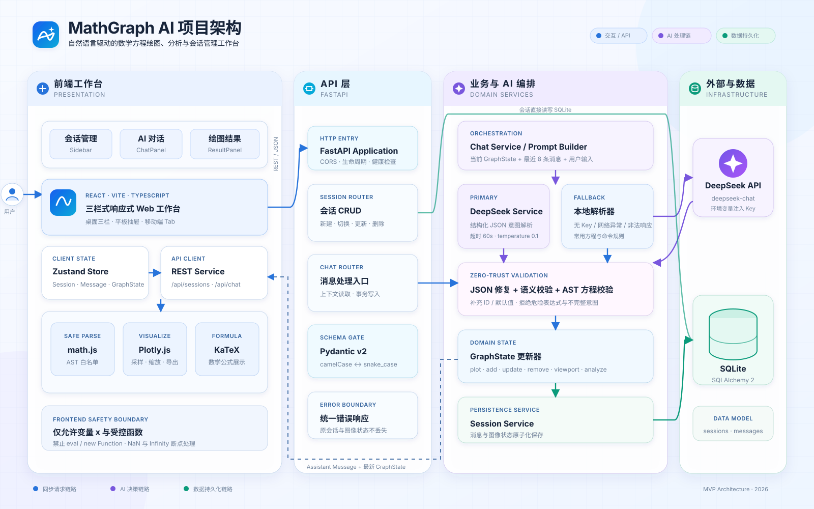
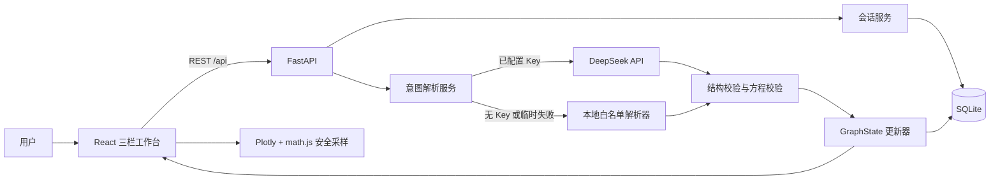

# MathGraph AI 实现架构

本文描述当前代码如何落地 `sw-design.md` 中的软件架构与 MVP 边界。

## 1. 总体结构

前后端共享 `Session`、`Message`、`GraphState`、`EquationItem`、`Viewport` 与 `StructuredResult` 这组稳定数据结构。API 使用 camelCase，Python 内部使用 snake_case，并由 Pydantic 自动转换。

## 2. 前端分层

- `components/layout`：顶部栏、品牌标识、可收起会话栏。
- `components/chat`：空状态、消息流、AI 生成状态、错误状态与输入区。
- `components/graph`：Plotly 画布、方程列表、坐标设置、分析结果和 PNG 导出。
- `stores/appStore.ts`：会话、加载状态、错误状态、移动端 Tab 与图像操作的单一状态入口。
- `services/api.ts`：REST API 边界。
- `utils/graphSampler.ts`：math.js AST 白名单校验与安全采样；不使用 `eval` 或 `new Function`。

桌面端为会话 / 对话 / 图像三栏，平板隐藏会话栏，移动端切换为会话 / 对话 / 图像 Tab。

## 3. 后端分层

- `routers`：HTTP 参数与响应，不包含模型调用细节。
- `services/deepseek_service.py`：唯一的 DeepSeek 网络调用入口。
- `services/local_parser.py`：无密钥时的常用意图回退，便于本地开发与基础可用性保障。
- `services/graph_service.py`：验证结构化结果并以纯规则更新 GraphState。
- `services/session_service.py`：会话与消息的序列化、持久化辅助。
- `utils/equation_validator.py`：Python AST 白名单校验和递归计算，不执行任意代码。
- `models` / `schemas`：SQLAlchemy 持久化模型与 Pydantic API 模型分离。

## 4. 关键状态流

1. 前端先乐观展示用户消息，并锁定重复发送。
2. 后端保存用户消息，加载当前 GraphState 和最近 8 条消息。
3. DeepSeek 或本地解析器产生 StructuredResult。
4. 后端再次校验表达式、补充方程 ID 与默认值，再更新 GraphState。
5. 成功时同时保存 AI 消息和新 GraphState；失败时保留原 GraphState，并保存错误消息。
6. 前端拿到完整会话后同步消息、方程列表与 Plotly 图像。

## 5. 安全与容错

- 前后端都只允许变量 `x` 和指定函数白名单。
- DeepSeek 输出不直接执行；必须经过 Pydantic 与表达式校验。
- 非 JSON、非法方程、NaN / Infinity、无有限采样值均转换成用户可见错误。
- 解析失败不会清空原方程或会话上下文。
- DeepSeek 未配置或临时不可用时，常用绘图请求由受限本地解析器继续处理。
