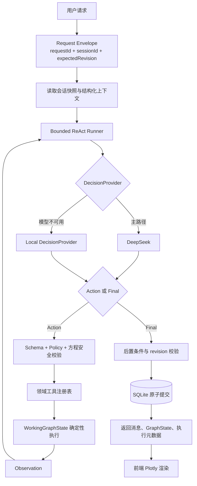

# MathGraph AI 链路改进与受约束 ReAct 引入计划（Plan 01）

## 1. 计划目标

在不破坏现有绘图、会话和本地解析能力的前提下，将当前“一次模型调用产生一个 `StructuredResult`”的链路，升级为所有自然语言请求统一进入的受约束 ReAct 链路：

```text
统一 AgentRunner
→ DeepSeek 或本地备用 DecisionProvider
→ Action / Tool / Observation 有界循环
→ WorkingGraphState 原子提交
```

本计划主要解决以下问题：

- DeepSeek 异常被静默降级，难以定位 API Key、认证、限流和网络问题。
- 一个请求只能表达一个主要 `intent`，复杂复合指令不容易完整执行。
- 当前没有请求幂等、GraphState 版本控制和并发冲突检测。
- 模型输出虽然经过结构和方程校验，但缺少表达式复杂度限制。
- 模型调用期间数据库会话持续存在，长请求的事务边界不够清晰。
- 会话上下文仅使用最近 8 条原始消息，缺少结构化操作上下文。
- 当前测试主要覆盖本地解析器，缺少模型契约、API、事务和端到端测试。

## 2. 核心架构决策

### 2.1 所有自然语言请求统一进入 ReAct

`POST /api/chat` 不再判断请求属于 Local、Plan 或 ReAct。所有自然语言请求统一进入一个有界 `AgentRunner`：

- 简单请求通常执行一个工具后返回 `final`。
- 复合请求通过连续多个 Action 自然完成，不再维护独立的 Plan-and-Execute 模式。
- 依赖中间计算结果的请求根据 Observation 决定下一步工具。
- DeepSeek 不可用时切换到本地备用 `DecisionProvider`，但仍输出相同的 `AgentAction`，继续使用同一个 Runner、ToolRegistry 和 Executor。

直接 UI 操作不调用 LLM，但必须转换为相同的 `Command`，经过同一个 ToolRegistry、Validator 和 Executor。这样统一的是状态执行逻辑，而不是让颜色选择、缩放、删除等即时交互承担模型调用开销。

### 2.2 LLM 只负责决策，不直接执行

DeepSeek 或本地备用 DecisionProvider 负责生成下一步受约束的 `AgentAction` 或 `final`。所有状态修改、数学计算和数据库写入由确定性代码完成。

### 2.3 Agent 仅能访问领域工具

Agent 不提供 Shell、文件系统、任意 HTTP、SQL 或 Python 执行能力，只允许调用数学绘图领域工具。

### 2.4 中间步骤不直接落库

ReAct 在 `WorkingGraphState` 副本上执行。所有步骤成功且 Agent 返回 `final` 后，检查状态版本并一次性提交；失败时丢弃副本，保留原始会话状态。

### 2.5 不记录模型原始思维过程

只记录可审计的动作信息：工具名称、参数摘要、Observation、耗时、错误和最终结果。不保存或展示模型的原始 chain-of-thought。

## 3. 目标链路



## 4. 目标数据结构

### 4.1 请求信封

```json
{
  "requestId": "req_...",
  "sessionId": "session_...",
  "expectedRevision": 12,
  "message": "画 y=x^2，并改成红色"
}
```

要求：

- `requestId` 全局唯一，用于日志关联和请求幂等。
- `expectedRevision` 用于发现多窗口、重试或并发请求造成的状态覆盖。
- 保留现有字段兼容期，前后端完成升级后再移除旧格式。

### 4.2 统一命令

```json
{
  "schemaVersion": 1,
  "commandId": "cmd_...",
  "type": "update_equation",
  "target": {
    "equationId": "eq_..."
  },
  "arguments": {
    "color": "#ef4444"
  }
}
```

首批支持的命令：

- `plot_equations`
- `add_equations`
- `update_equation`
- `remove_equation`
- `set_viewport`
- `set_graph_settings`
- `analyze_function`
- `explain_graph`

后续计算能力：

- `calculate_intersections`
- `calculate_zeros`
- `calculate_extrema`
- `compare_functions`
- `fit_viewport_to_points`

### 4.3 AgentDecision

```json
{
  "type": "action",
  "tool": "plot_equations",
  "arguments": {
    "equations": [{"expression": "y = x^2", "color": "#ef4444"}]
  }
}
```

Agent 完成全部必要动作后返回：

```json
{
  "type": "final",
  "message": "已绘制 y=x²，并将曲线设置为红色。"
}
```

只有 `final` 可以触发 WorkingGraphState 的最终校验和提交。

### 4.4 Observation

```json
{
  "type": "observation",
  "tool": "calculate_intersections",
  "success": true,
  "data": {
    "points": [{"x": -1, "y": 1}, {"x": 3, "y": 9}]
  }
}
```

### 4.5 响应元数据

```json
{
  "requestId": "req_...",
  "executionMode": "react",
  "decisionProvider": "deepseek | local",
  "fallbackUsed": false,
  "graphRevision": 13,
  "stepCount": 3,
  "message": {},
  "graphState": {}
}
```

## 5. 领域工具设计

| 工具 | 权限 | 输入重点 | 输出重点 |
| --- | --- | --- | --- |
| `get_graph_state` | 只读 | session snapshot | 方程、视口、revision |
| `plot_equations` | 暂存写 | 方程列表 | 新 WorkingGraphState |
| `add_equations` | 暂存写 | 方程列表 | 新增方程 ID |
| `update_equation` | 暂存写 | equationId、updates | 修改后的方程 |
| `remove_equation` | 暂存写 | equationId | 剩余方程摘要 |
| `set_viewport` | 暂存写 | x/y 范围 | 新 viewport |
| `analyze_function` | 只读计算 | equationId | 零点、极值、单调性等 |
| `calculate_intersections` | 只读计算 | equationIds | 交点列表与误差范围 |
| `fit_viewport_to_points` | 暂存写 | 点集、padding | 推荐 viewport |

所有工具必须满足：

- 使用 Pydantic 定义输入和输出 Schema。
- 工具内部不调用 LLM。
- 写工具只修改 `WorkingGraphState`。
- 方程进入工具前后都经过统一安全校验。
- 工具返回大小受限，避免 Observation 挤占模型上下文。
- 工具错误使用稳定错误码，不把异常堆栈直接传给模型或前端。

## 6. 分阶段实施计划

### 阶段 0：基线冻结与测试样本

> 状态：**已完成**（见 `docs/baseline/`）

目标：在重构前建立可比较的行为基线。

任务：

- [x] 收集当前支持的成功、解析失败、DeepSeek 失败和会话切换用例。
- [x] 为现有 `/api/chat`、会话 CRUD、本地解析和 GraphState 更新补齐集成测试。
- [x] 建立前后端共用的表达式测试样本，验证 Python AST 与 math.js 行为一致。
- [x] 记录当前请求耗时、失败率和本地降级次数作为改造前基线。

验收标准：

- [x] 当前 MVP 主链路可以通过自动化测试重复验证。
- [x] 测试失败能明确指出是模型契约、表达式、状态更新还是持久化问题。

### 阶段 1：可靠性、安全和可观测性

> 状态：**已完成**（见下方实现要点与 `backend/tests/test_idempotency_revision.py` 等）

目标：先解决静默错误和安全上限，再扩展 Agent 能力。

任务：

- [x] 将 `except Exception` 改为明确的模型异常分类：认证、限流、超时、网络、响应格式和 Schema 错误。
- [x] 增加结构化日志字段：`requestId`、`sessionId`、`agentMode`、`decisionProvider`、`model`、耗时、fallback、错误码。
- [x] 增加 DeepSeek 超时、有限重试和错误映射；只对可重试错误重试。
- [x] 为方程增加长度、AST 节点数、嵌套深度、数值常量和指数范围限制。
- [x] 为 GraphState 增加最大方程数量、viewport 合理范围和分析结果大小限制。
- [x] 增加 `requestId` 幂等检查和 `GraphState.revision` 乐观锁。
- [x] 引入可管理的 SQLite Schema 迁移机制，保留现有数据。

验收标准：

- [x] DeepSeek 配置错误可以切换 LocalDecisionProvider，但必须明确记录 `fallbackUsed`、原因和错误分类，不能静默掩盖。
- [x] 同一个 `requestId` 重试不会生成重复消息或重复修改状态。
- [x] 旧 revision 写入返回明确的冲突错误，不覆盖新状态。
- [x] 恶意或超复杂表达式能在确定时间内被拒绝。

### 阶段 2：统一 Action、Command 与确定性 Executor

> 状态：**已完成**（见 `backend/app/agent/` 与 `backend/tests/test_executor.py`）

目标：彻底分离“模型决策”和“状态执行”。

任务：

- [x] 新增 `AgentAction`、`AgentFinal`、`Observation`、`Command` 和 `ExecutionResult` Schema。
- [x] 将现有 `StructuredResult` 适配成 `AgentAction`，作为迁移期兼容层。
- [x] 把 `graph_service.py` 重构为无数据库依赖的确定性 Executor。
- [x] 建立工具注册表、工具参数 Schema 和执行 Policy。
- [x] 建立 `WorkingGraphState`，执行期间不直接修改数据库状态。
- [x] 将直接 UI 操作转换为 Command，并复用相同的 Executor；UI 操作不调用 DecisionProvider。
- [x] 增加执行前置条件、后置条件和完整回滚测试。

验收标准：

- [x] 相同 GraphState 和 Command 必须产生相同结果。
- [x] 任一命令失败时，原 GraphState 不发生变化。
- [x] AgentAction 与 UI Command 进入相同状态执行边界。
- [x] 现有单步请求和直接 UI 操作行为与重构前一致。

### 阶段 3：统一有界 ReAct

目标：所有自然语言请求统一通过一个 AgentRunner 执行，简单和复杂请求只在步骤数量上不同。

任务：

- 新增唯一的 `AgentRunner`，实现 Decision → Action → Tool → Observation → Decision 循环。
- `/api/chat` 无条件进入 AgentRunner，不再包含 Local、Plan、ReAct 路由判断。
- 建立 `DeepSeekDecisionProvider`，输出严格的 `AgentAction` 或 `AgentFinal`。
- 将本地解析器改造成 `LocalDecisionProvider`，输出相同协议，模型不可用时由 Runner 切换 Provider。
- 简单请求允许执行一个工具后立即 `final`；复合请求连续调用多个工具。
- 首期最大步骤数设为 4，稳定后最多扩展到 6。
- 设置整体超时、单工具超时、最大 Observation 大小和最大模型调用次数。
- 检测同一工具和相同参数的重复调用，连续重复时终止循环。
- 支持原生 `tool_calls` 和 JSON Action 两种模型适配方式，AgentRunner 不依赖具体模型协议。
- 每一步均在 WorkingGraphState 上执行，只有收到合法 `final` 后才允许进入最终提交。
- 增加公开的执行摘要，前端可展示工具动作和结果，但不展示内部思维过程。

验收用例：

```text
画 y=x^2，并改成红色，把坐标范围设置为 -5 到 5。
```

预期：请求进入统一 AgentRunner，连续完成绘图、改色和视口调整，收到 `final` 后一次性提交。

### 阶段 4：ReAct 工具扩展与 Shadow 稳定

目标：在统一 ReAct 主链路稳定后，增加真正依赖 Observation 的数学工具，并通过 Shadow 模式验证执行质量。

任务：

- 增加交点、零点、极值、函数比较、采样检查和视口拟合工具。
- 工具 Observation 使用稳定 Schema、误差范围和大小限制。
- 通过 `shadow` 同时运行新 Agent 决策但不提交，对比旧链路或基准答案。
- 建立 Agent 轨迹回放测试，确保同一组模拟决策可以稳定重放。
- Agent 失败时返回结构化错误；DeepSeek 不可用时切换 LocalDecisionProvider，而不是离开 Runner。
- 对工具精度、循环终止、回滚、超时和重复调用进行专项测试。

首批工具增强场景：

- 计算两条函数交点后自动调整视口。
- 分析零点或极值后，在图上添加对应标记。
- 根据采样结果判断函数在当前范围是否可绘制，再决定视口或提示用户。
- 比较多条函数，并根据计算结果生成解释。

验收用例：

```text
画 y=x^2 和 y=2*x+3，找出交点并把视图放大到交点附近。
```

预期：同一个 AgentRunner 先绘图，再调用交点计算工具，根据 Observation 调整 viewport，收到 `final` 后一次性保存。

### 阶段 5：上下文、前端体验和性能

目标：让复杂执行过程对用户可理解，同时控制上下文和请求成本。

任务：

- 上下文优先传递结构化命令历史、方程 ID 和当前状态，减少原始聊天文本。
- 为较早消息生成会话摘要；最近消息采用可配置 token 预算，而不是固定 8 条。
- `/api/chat` 直接返回最新会话摘要和消息增量，减少前端随后再次 `GET session`。
- 会话消息改为分页加载，避免每次读取完整历史。
- 前端增加阶段状态：理解请求、执行命令、计算结果、保存状态。
- 明确展示 `deepseek` 或 `local` DecisionProvider 以及 fallback 状态，但不展示内部思维过程。
- 支持取消长请求；取消后不提交 WorkingGraphState。

验收标准：

- 长会话不会因加载全部消息明显变慢。
- 用户能够区分正常模型执行和本地降级。
- 取消、超时或刷新页面不会产生半完成状态。

## 7. 建议代码结构

```text
backend/app/
  agent/
    __init__.py
    runner.py              # 所有自然语言请求的统一有界 ReAct 循环
    providers.py           # DeepSeek / Local DecisionProvider
    schemas.py             # Command、Action、Final、Observation
    registry.py            # 工具注册表
    policy.py              # 权限、步骤、重复调用和大小限制
    context_builder.py     # 结构化上下文和 token 预算
    tools/
      __init__.py
      graph_tools.py
      analysis_tools.py
      viewport_tools.py
  services/
    deepseek_service.py    # 模型协议适配、错误分类、重试
    graph_service.py       # 确定性 Executor
    local_parser.py        # LocalDecisionProvider 的规则能力
    session_service.py
  schemas/
    agent.py
    chat.py
    graph.py
  routers/
    chat.py
```

前端建议调整：

```text
src/
  stores/appStore.ts       # requestId、revision、执行阶段、取消
  services/api.ts          # 新请求/响应契约与冲突处理
  types/agent.ts           # AgentStatus、StepSummary、错误码
  components/chat/
    AgentProgress.tsx      # 展示可公开的执行步骤摘要
```

## 8. 数据库调整

建议新增或调整：

### sessions

- `revision INTEGER NOT NULL DEFAULT 0`
- `schema_version INTEGER NOT NULL DEFAULT 1`
- `context_summary TEXT NULL`

### messages

- `request_id TEXT NULL`
- `agent_mode TEXT NULL`
- `decision_provider TEXT NULL`

### agent_runs

- `id`
- `request_id`，唯一索引
- `session_id`
- `status`
- `agent_mode`
- `decision_provider`
- `model`
- `step_count`
- `fallback_used`
- `error_code`
- `started_at`
- `finished_at`

### agent_steps

- `id`
- `run_id`
- `step_index`
- `tool_name`
- `arguments_summary`
- `observation_summary`
- `status`
- `duration_ms`

注意：不保存 API Key、Authorization Header、完整模型内部思考或未经清理的敏感输入。

## 9. 配置与功能开关

建议新增环境变量：

```env
AGENT_MODE=off
AGENT_MAX_STEPS=4
AGENT_TIMEOUT_SECONDS=45
AGENT_TOOL_TIMEOUT_SECONDS=10
AGENT_MAX_REPEATED_ACTIONS=1
AGENT_TRACE_ENABLED=true
MAX_EQUATIONS=20
MAX_EXPRESSION_LENGTH=256
MAX_AST_NODES=128
MAX_POWER_EXPONENT=100
```

`AGENT_MODE` 建议值：

- `off`：保持当前单步链路。
- `shadow`：所有请求运行 ReAct，但不提交 Agent 结果，仅记录与当前结果的差异。
- `react`：所有自然语言请求统一进入 ReAct，并允许提交最终结果。

## 10. 测试计划

### 单元测试

- 每个 Command 的成功、失败和边界输入。
- 每个工具的输入 Schema、错误码和确定性。
- 方程长度、深度、指数、数值范围和不支持节点。
- Agent 重复工具调用和步骤上限。
- WorkingGraphState 的提交与丢弃。

### 模型契约测试

- 正常 JSON。
- Markdown 包裹 JSON。
- 缺字段、错误字段类型和未知工具。
- 后续 Action 正确引用前序 Observation 和新建方程 ID。
- 模型返回 final 但没有可提交结果。
- 原生 tool call 与 JSON Action 适配结果一致。

### API 集成测试

- requestId 幂等。
- revision 冲突。
- DeepSeek 认证失败、429、超时和 500。
- 本地降级是否符合策略。
- Agent 超时或取消后数据库没有部分写入。

### 端到端测试

- 单步绘图保持兼容。
- 单步和复合请求都经过统一 AgentRunner。
- 复合请求的多个 Action 一次性提交。
- 交点计算后调整视口。
- 长会话消息分页。
- 前端显示执行阶段、降级和冲突提示。

## 11. 发布与回退策略

1. 默认 `AGENT_MODE=off`，先发布可靠性、安全、Command 和 Executor 改造。
2. 使用 `shadow` 让所有自然语言请求运行 ReAct，但不提交 Agent 结果。
3. 对比当前结果和 Shadow Agent 结果，修正 Prompt、Action Schema、工具和终止策略。
4. 开启 `react`，所有自然语言请求统一进入 AgentRunner。
5. 直接 UI 操作继续使用统一 Command/Executor，不调用 DecisionProvider。
6. 出现异常时通过配置立即退回 `off`，不需要回滚数据库数据。

回退必须保证：

- 新增字段有默认值，旧代码仍能读取会话数据。
- Agent 运行记录与会话核心数据分离。
- 关闭 Agent 后，迁移期兼容适配器仍可支持现有单步链路。

## 12. 质量指标

改造完成后持续观察：

- 请求成功率。
- DeepSeek 认证、限流、超时和格式错误次数。
- DeepSeek 与 Local DecisionProvider 的使用比例。
- Provider fallback 次数和原因。
- 平均及 P95 请求耗时。
- 平均 Agent 步骤数和模型调用次数。
- 幂等命中次数和 revision 冲突次数。
- 非法表达式拒绝率。
- Agent 中止、取消和回滚次数。
- 用户请求后再次纠正的比例。

## 13. 风险与控制措施

| 风险 | 控制措施 |
| --- | --- |
| 所有请求进入 ReAct 后延迟与调用成本增加 | 简单请求允许一步工具后 final；限制步骤数、上下文和输出大小 |
| 模型调用不存在的工具 | 工具注册表白名单和严格 Schema |
| Agent 循环或重复动作 | 最大步骤、重复检测、整体超时 |
| 中间步骤写入造成半完成状态 | WorkingGraphState + 最终一次事务提交 |
| 网络重试造成重复操作 | requestId 幂等约束 |
| 多窗口覆盖状态 | revision 乐观锁 |
| 表达式造成计算资源消耗 | 长度、AST、指数、采样和耗时限制 |
| 模型协议变化 | DeepSeek Adapter 隔离原生 tool call 与 JSON Action |
| 会话上下文越来越大 | 结构化操作记录、摘要和 token 预算 |

## 14. 完成定义

满足以下条件时，Plan 01 可视为完成：

- 现有单步绘图功能保持兼容。
- 模型错误具有明确分类、日志和用户可理解提示。
- 请求具备幂等能力，GraphState 具备版本冲突保护。
- 所有自然语言请求均通过统一 AgentRunner 执行，不存在独立 Local/Plan/ReAct 业务分支。
- 简单请求可以在一次工具调用后 `final`，复合请求可以通过多个 Action 原子完成。
- 至少一个依赖 Observation 的数学场景通过统一 ReAct 完成。
- ReAct 具备步骤、超时、工具、Observation 和状态写入限制。
- Agent 执行失败、取消或超时时，数据库不会保存半完成状态。
- DeepSeek 和 Local DecisionProvider 输出相同 Action 协议并共享同一执行链路。
- 直接 UI 操作复用相同 Command/Executor，但不调用 LLM。
- 自动化测试覆盖统一 ReAct、Provider 回退、UI Command 和关闭 Agent 的兼容链路。
- 可以通过配置在 `off`、`shadow`、`react` 之间切换。

## 15. 推荐实施顺序摘要

```text
测试基线
→ 错误分类与安全限制
→ requestId / revision / 事务边界
→ Action + Command + Executor + WorkingGraphState
→ 统一有界 ReAct Runner
→ 全请求 Shadow 模式
→ 全自然语言请求启用 ReAct
→ Observation 数学工具扩展
→ 上下文、分页、取消和性能优化
```

该顺序先建立统一执行边界和可回退能力，再把所有自然语言请求切换到同一个受约束 ReAct 主链路。
